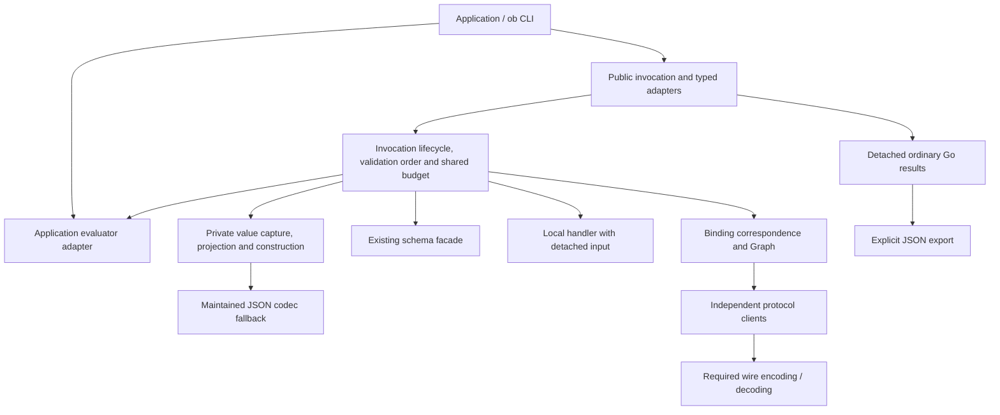

# Go invocation value migration

Status: implementation plan executed on the migration branches, 21 September
2026. See [qualification](VALUE_MIGRATION_QUALIFICATION.md) for implemented
stages, measured tradeoffs and the remaining activation gates. This plan itself
is not release authorization.

This is the implementation companion to [the value architecture decision](VALUE_ARCHITECTURE_PLAN.md).
That document owns the value, ownership and resource contracts; this plan fixes
the code boundaries, migration sequence and evidence needed to deliver them.
The intended destination is projected ordinary containers, eligible native
leaves, faithful codec fallback and checked construction of ordinary Go results.
It preserves application-selected transform evaluators.

## 1. Decision, evidence and completion

Proceed toward P as the preferred implementation direction. The real invocation
comparison supports it for the tested existing consumers. It does not establish
that every workload improves, that native HTTP bytes are necessary, or that the
prototype is ready to become production code.

The comparison used SDK base `71cbd964a8df7a5d2b2981756d351d3a59b86c5d` and
OpenAPI client `7b15d57e960faa6a9e010eb9cbea80fd83f0d02e`. Planning HEAD before
this document was `ad664902245bda6b03b8fa906126f7c53b99f0de`, on
`codex/native-value-migration`. Its runtime is still the base runtime. Refresh
these pins and the project integration authority before implementation begins;
ongoing evaluator work must not be overwritten or silently adopted.

The workspace evidence is `design/sdk-invocation-comparison/RESULT.md`, with
the frozen charter, source audit, independent comparative review, manifests,
normal/race logs and measurements beside it. Preserve those artifacts unchanged.
They are historical evidence, not files to copy into the SDK. The production
qualification report must be committed with the SDK so it can be reviewed
without this workspace.

The most useful results are:

| Path | Evidence and implication |
| --- | --- |
| Small typed local invocation | P took about 32.3 µs versus 39.7–40.0 µs for owned codec handling. Direct typed conversion is worth preserving. |
| Wide typed value, narrow result | P took about 1.73 ms versus 2.59 ms for owned codec handling and 2.69 ms for the native-reader challenger. This is the strongest projection-specific result. |
| Small generic invocation | P and the owned codec control were effectively tied, about 31 µs. Today's shared-identity path was about 23.4 µs; ownership has a real cost. |
| HTTP image recovery | P and the reader challenger both improved from about 12.4 ms to 4.8 ms. The client already supplied Base64 text; checked typed recovery explains most of this benefit. |
| Raw-response hook | Added copies and materialization made it slower. Changing the client to carry raw bytes is not a prerequisite. |

These are two measurement rounds on one M1 Max host using Go 1.27.1, not release
qualification on the module's declared toolchain. Production accounting,
public/internal separation, Graph, request mapping and full codec parity were
outside that slice. Retained-heap measurements do not measure transient peak.

The migration is complete only when all of these hold:

1. Ordinary typed invocation paths no longer use JSON text merely to cross SDK
   boundaries. Necessary wire codecs and faithful custom-codec fallback remain.
2. Generic and typed public calls have documented snapshot semantics, return
   ordinary Go values, and preserve exact supported logical meaning and bytes.
3. All SDK-controlled value retention and construction follow the finite policy,
   including retries, Graph and output draining after failure.
4. Root, all eight format modules, direct/foreign providers, prepared/composed
   calls, code-generated consumers and the CLI pass the required qualification.
5. Performance and retention are measured with the final ownership and accounting
   machinery enabled. The remaining costs and regressions are reported.
6. Compatibility and language-neutral guidance describe the actual destination.
   Release and project activation are separate, explicit steps.

## 2. Scope and responsibility

Keep the existing repositories and public invocation concepts. Application code
supplies inputs, reads outputs and chooses an evaluator. It does not manage SDK
value wrappers, borrowing modes, reference registries or release tokens.

| Area | Work in this migration | Boundary to preserve |
| --- | --- | --- |
| Root models, `validate.go`, schema facade | Integrate the shared logical presentation where invocation values are validated; preserve syntax checks and capability errors. | No runtime evaluator selection, protocol mapping or policy engine. |
| `jsonvalue`, private value helpers, maintained codec | Capture, projection, scalar interpretation, bounded fallback, detached construction and explicit export. | No invocation, schema, evaluator or format imports in the value implementation. |
| `invoke` | Public/private handoffs, resource ownership, transform/schema order, errors, retries and local adapters. | Existing public invocation interfaces and application evaluator hook remain. |
| `sdk/runtime.go` | Pass explicit configuration to invocation. | No binding or evaluator defaults. |
| `formats/*` | Each governing correspondence, private SDK transfers, accounting of retained operation data. | No universal native-byte or number rule replacing a family's rules. |
| Standalone clients | Qualify existing request/response behavior; change only a demonstrated client-owned limitation. | No SDK snapshot, lease, ledger or invocation type in their API. |
| `ob` | Qualify real application composition, display/export and generated consumers. | CLI chooses evaluator, authorization, credentials, persistence and UI behavior. |

The current SDK's `invoke/jsonata` adapter is explicitly imported, not a default
installed by `sdk`. `validate.go` also imports the independent syntax package.
Thus runtime injection already exists, but the root module graph still contains
the JSONata module. Do not describe that graph as having no evaluator-related
dependency. Adapter packaging or syntax dependency changes are a separate unit
with their own consumers; this migration does not require deleting them or
waiting for a replacement engine. An engine-independent runtime boundary does
not require rewriting document syntax validation.

The standalone OpenAPI client currently imports SDK `jsonvalue` helpers. Record
that dependency-direction issue separately. Removing it must preserve its codec
and number behavior; replacing it with `encoding/json` is not an automatic fix.
Neither that cleanup nor raw-carrier optimization blocks checked SDK recovery.

## 3. Compatibility contract

Publish this matrix in release-facing documentation before activation. Turn
each row into a concrete fixture, including direct lower-level calls.

| Surface | Destination behavior | Migration consequence |
| --- | --- | --- |
| `Invocation`, `OutputStream`, `BindingHandle`, operation signatures | Keep their operations and generic caller shapes. | No mandatory application rewrite around a value type. |
| `Write` / `EmitOutput` | Successful handoff owns a stable snapshot. Capture has stopped reading producer storage when the method returns, including rejection. | Callers may reuse values afterward; mutation during the call remains invalid. |
| Generic maps/slices and exact-type recovery | Public handoffs detach mutable data, including repeated occurrences within one result. | Intentional breaking change from current reference identity. No legacy-identity switch. |
| Raw `Invocation[any,any].Outputs()` | Ordinary logical maps, slices and scalars; a logical byte string is a string. | No prototype marker or private leaf appears in `any`. |
| Typed result / local typed input | Checked construction into the requested Go type; ordinary byte fields recover exact bytes where codec/correspondence permits. | Same bytes, without promising the original backing allocation. |
| Missing, null, empty, undefined | Preserve their separate meanings. Ordinary nil maps/slices/bytes mean null; nonnil empty values remain empty. Binding raw zero octets can mean an empty logical string. | Fix inconsistent paths explicitly; do not let storage nilness decide a binding's meaning. |
| Numbers and strings | Exact supported tokens and codec-defined string/float32 behavior. Unsupported values fail honestly. | No widening through float64, silent numeric repair or replacement of maintained Unicode behavior. |
| Custom encoders/decoders and tags | Maintained codec defines meaning and field selection; conservative fallback preserves it. | Optimization eligibility may shrink without changing meaning. |
| Transform hook | Ordinary logical values, existing null/undefined/error convention, application-selected adapter. | No engine-specific carrier requirement. Capture returned values before internal retention. |
| Schema failure | Actual mismatch retains its classification; resource/capability failure remains a runtime failure. | Graph predicates must not convert inability to validate into `false`. |
| Typed output conversion failure | Consume that output, return zero result and an inspectable local conversion error; later outputs remain readable. | Does not retroactively fail or retry the operation. |
| Finite limits | Default value/depth/live limits apply before allocation/retention; direct calls also use them. | Newly rejected oversized work is documented as a breaking host-policy change. |
| Explicit JSON | Applications may marshal detached ordinary results for display/storage. SDK bounded export is an explicit operation. | Invocation never depends on the display representation. |
| Context, authorization, selection and delegation | Existing contracts and opaque application policy remain. | Value migration does not reinterpret credentials or add policy decisions. |

`NewInvocationImpl[I,O]` is a public lower-level entry, not a loophole. Its public
methods must obey capture/detachment for supported I/O too. Custom implementations
of `Invocation` remain substitutable through the public interface. The SDK can
bound its own copying and isolate values it receives; it cannot guarantee the
foreign implementation's internal retention or prevent that implementation from
concurrently mutating a value it has handed off contrary to contract.

For callbacks that return a value (`LocalUnary`, evaluator, decoder hooks),
return transfers that result for SDK capture; the callback must not retain a
concurrent writer to it. A reusable producer uses synchronous `EmitOutput`, or
returns a private result. Returning a shared mutable global and modifying it
immediately in another call cannot be made safe by a copy started after return.
This limitation belongs in examples as well as reference documentation.

## 4. Private value implementation

### Placement and representation

Add a small `internal/value` package below `jsonvalue` and `invoke`. It may depend
on the maintained codec and existing low-level string helpers, but never on
`invoke`, a schema backend or an evaluator. Move only shared low-level numeric
or string helpers needed to avoid an import cycle; keep public `jsonvalue` APIs
as facades with their existing behavior. Do not duplicate codec policy in two
independent reflection engines.

An internal snapshot contains a projected logical root and its checked cost
metadata. Object/array shells are SDK-owned and immutable by contract. Finite
private leaves carry eligible storage plus an established logical kind: initially
ordinary scalar forms and owned bytes with canonical Base64 string meaning.
Byte leaves distinguish ordinary nil/null admission from binding-produced empty
raw content. There is no arbitrary per-value mapping registry.

Representation and retention are separate. A snapshot does not release itself
or own an invocation; each retaining owner holds a reservation. Transfer moves
a reservation only when the previous owner no longer retains the root. Fan-out
creates another fully charged owner even when immutable storage is shared.

### Capture and eligibility

1. Acquire the appropriate capture permit before allocating a snapshot.
2. Resolve type/codec eligibility without invoking user encoders speculatively.
   Check dynamic children and addressability as well as the static root type.
3. For eligible generic or typed trees, fuse checking, costing and capture.
   Project ordinary containers once; compact owned byte copies and selected
   subranges; inspect all logical descendants, including unselected branches.
4. If codec meaning is needed anywhere, use one faithful whole-value fallback
   for that handoff. Release provisional projection/scratch before fallback.
   Do not invoke an encoder twice while probing, or encode individual fields
   in an order that changes whole-value codec behavior.
5. Admit the fallback's decoded logical result under the same depth/cost rules.
   An invalid generic number is an error, not permission for a codec to repair it.

Start with the smallest eligible domain that covers the measured ordinary
workloads. The codec retains authority for custom JSON/text methods, map-key
conversion/collisions, ambiguous embedding, unsupported tags and other unproven
cases. Reuse its field metadata through a narrow internal helper where useful;
the maintained codec's public behavior must not be changed to simplify projection.
Caches contain immutable type plans, never caller values or invocation scopes.
Define a bounded cache policy for dynamically created types rather than making
each encountered type an unbounded process-lifetime retention entry.

### Logical presentation and consumer isolation

Keep the existing schema backend first. Supply a bounded logical presentation
from the snapshot: ordinary containers and exact supported scalar values, with
Base64 materialization when a consumer needs a string. A synchronous SDK-owned
read-only consumer may reuse safe shells; a callback that can mutate or retain
input receives a detached logical presentation. Never give an application
evaluator the internal mutable maps merely because current adapters read them.

The first implementation of the existing evaluator hook uses ordinary logical
values. A hook result is admitted once, including typed/custom-codec results
that are valid under the hook's result contract. Engine functions and other
non-document results must be rejected by the adapter before codec conversion.
No-result uses `ErrTransformUndefined`; `nil, nil` remains null.

This path accommodates gnata and other adapters now. It can recover the original
bytes after a field-moving transform even when the adapter works with Base64
strings. A future native-preserving adapter path needs its own demonstrated
benefit and compatibility contract; it is not a new mandatory hook in this plan.
Count logical materialization and adapter normalization in measurements.

### Construction, fallback and export

Direct construction must preserve the maintained decoder's supported observable
semantics, including field matching, tags, null, overflow, fixed arrays, pointer
allocation and byte decoding. Use a fresh destination and expose it only after
success. Duplicate logical occurrences construct separate mutable destinations.
An exact Go type assertion is not an ownership exemption.

Before ordinary construction, estimate full host layout/cardinality with checked
arithmetic: ignored fixed fields and zero-fill, pointer targets, slice backing,
maps/keys/values and scratch. Charge the greater of logical cost and conservative
host construction cost, plus simultaneously live scratch. A tiny JSON object
must not cause an unchecked huge Go allocation. An unsupported safe estimate
uses a bounded codec path or refuses before allocation. It must not silently
call an unbounded decoder instead.

Implement codec buffer/decode bounds inside the maintained codec adapter where
allocation actually happens. A size check after `Marshal`, or a limited writer
around an encoder that first builds a full internal buffer, is insufficient.
Custom callbacks receive private encoded input and a fresh outer destination;
their own internal allocations and side effects are outside SDK control. Count
and cap their returned content before retaining or copying it further. Do not
invoke user methods during a supposedly side-effect-free size estimate.

Public `jsonvalue.Marshal` remains the existing general JSON helper; do not
silently apply invocation limits to all document serialization. Add one explicit
bounded export entry point in `jsonvalue` (proposed spelling
`MarshalWithOptions(value, MarshalOptions{MaxValueUnits, MaxDepth})`) over the
same bounded value/codec implementation. Zero selects documented defaults;
negative/overflowing options fail. Ordinary application use of another marshaler
is application-owned work. No separate snapshot/export repository is needed.

## 5. Invocation boundaries and resource lifecycle

### Public facades over private transfer

Replace queued `any` payloads inside SDK-owned invocation paths with private
owned packets. Retain the public interfaces. Provide private input/output
operations for SDK orchestration so typed adapters, retry pumps and Graph can
transfer packets without detaching to a public result and then capturing again.

Use a narrow SDK-internal bridge shared with format modules for these operations
and scope propagation. It must be below `invoke`, contain no protocol concepts,
and exchange only private snapshot/reservation primitives and ordinary errors.
Go's internal import boundary permits the SDK's nested format modules to use it;
it does not make it an application extension API. A sealed accessor implemented
through a private embedded helper can expose an endpoint to this bridge without
adding exported invocation operations. Bind access to the SDK-created facade;
an arbitrary foreign wrapper embedding an SDK handle must not accidentally
bypass its overridden public behavior. Prove this with a foreign-wrapper test
before replacing queues, rather than introducing a global handle registry.

| Handoff | Action and reservation owner |
| --- | --- |
| Caller `Write` | Snapshot under input permit; validate the admitted input; transfer ownership on queue acceptance. |
| SDK input pump / prepared route | Take owned packet; transfer or retain explicitly for validation, transform and replay. |
| Local or third-party handler | Construct private mutable input; callback owns returned host input. Capture its emitted result before acknowledging emission. |
| SDK binding / Graph child | Use the internal transfer bridge and the same invocation scope; no public detachment for an internal hop. |
| Public raw/generic output | Materialize detached logical values using the accepted output's reserved delivery capacity. |
| Public typed output | Claim the same underlying stream once, construct directly under its separate conversion allowance, release source after conversion. |
| Foreign invocation | Use public methods; capture/construct at the SDK wrapper. Do not assert that foreign internal work is accounted. |

`TypedInvocation.Outputs()` must choose the owned stream before claiming it;
calling public `Outputs()` and then acquiring a second private reader is invalid.
Its single-consumer guard spans conversion, not just dequeue. A public generic
read followed by typed conversion is also the wrong fast path: it would pay for
both materializations. Test both raw and typed `[any,any]` entry points, which
the prototype did not both qualify.

### Configuration and errors

Use one process-local `invoke.ValueLimits` configuration with `MaxValueUnits`,
`MaxLiveUnits` and `MaxDepth`. Proposed entry points are:

- `OperationInvoker.ValueLimits` and `sdk.RuntimeOptions.ValueLimits` for defaults.
- `PrepareLocalProviderOptions.ValueLimits` for its internally constructed invoker.
- `WithValueLimits(...)` as an `InvokeOption`, also honored by prepared routes.
- `BindingInvocationArgs.ValueLimits` for direct binding calls, excluded from JSON.
- A variadic low-level constructor option, `WithInvocationValueLimits(...)`, for
  `NewInvocationImpl` and foreign `NewTypedInvocation` adapters. Existing calls
  remain valid; constructor function-value assignments need compatibility checks.

Resolve configuration once before dispatch. Per-call nonzero fields override
invoker defaults; remaining zero fields resolve to SDK defaults. A foreign typed
wrapper gets defaults unless explicitly configured. An SDK-owned typed wrapper
inherits its invocation's limits; it cannot grant itself a larger internal scope.
Defaults are 64 MiB value units, 256 MiB live units and depth 256. Reject negative
and overflowing settings. Constructors already returning an error use it; an
invocation-returning constructor returns an inert failed invocation with
`ERR_RUNTIME`. No provider work runs for invalid configuration.

These are distinct from `MaxDeliveryUnitBytes` (currently 10 MiB by default).
Keep that protocol read bound and its current fallback semantics. Both limits
apply; do not rename bytes to units or silently change the transport cap.

Use an inspectable local `ValueConversionError` for public output conversion,
wrapping the existing classified invocation error, with a fixed stage and
payload-free cause. Resource details contain only stage, limit kind and allowance.
Preserve `errors.As(..., *InvocationError)` compatibility. For invocation-terminal
resource failures, retain local details in an unexported cause on the terminal
record (with `Unwrap`); copying/normalization must preserve that cause in-process,
while JSON encoding and portable `Data` exclude it. Do not put native errors,
decoder text or input fragments in portable diagnostics.

### Ledger, concurrency and backpressure

Implement the architecture document's cost formula once: 64 units per logical
node plus escaped UTF-8 string/key lengths and number token lengths; byte strings
use computed canonical Base64 length; repeated occurrences count repeatedly.
Use checked arithmetic and stop at the first exceeded bound. Units are a work
and retention allowance, not a byte-accurate heap promise or elapsed CPU quota.

Keep the accounting mechanism private and dependency-free from invocation
semantics. `invoke` decides scope, failure classification, ownership and waiting.
Reservations are explicit owned objects with checked transfer/release operations;
debug tests detect double release and negative accounting. Do not depend on GC
finalizers to make capacity available for live work.

- One input capture and one output capture may allocate per session at a time.
  Acquire permits before copying and hold through acceptance/rejection, never
  through handler/evaluator execution. Across child sessions the shared ledger
  bounds the aggregate; metadata and waiting work remain bounded too.
- Reserve before allocation, including partial capture, scratch and independent
  retained roots. Same-scope transfer avoids double charging when ownership ends;
  replay/fan-out retention requires another charge before publication.
- Every accepted **publicly drainable** output holds three times its expanded
  logical cost: stored value, logical delivery and codec scratch. Other work
  cannot borrow its delivery capacity.
- Wait only if removing already publicly drainable outputs would allow the next
  bounded reservation to fit. Recheck on release/termination under the appropriate
  context. Other active, replay and Graph retention is not presumed releasable.
- An internal child queue must never advertise itself as a public drain that can
  independently relieve pressure. Graph scheduling can depend on the very work
  requesting capacity. Exhaustion there fails promptly rather than self-deadlocking.
- Admission resource failure rejects that value, terminates with `ERR_RUNTIME`,
  does not retry context resolution, and preserves accepted public outputs.
- Public typed conversion/export has a separate per-conversion allowance; it
  cannot consume capacity reserved to drain other accepted outputs. Keep source
  retention charged until conversion finishes. SDK-internal handler construction
  uses the invocation ledger instead.

An invocation root owns its scope. Retries and SDK-created Graph descendants
receive that scope through the private bridge; they do not reset limits. Public
top-level invocation entry points create a new scope even if their Go context
descends from another invocation's context. Inheritance is an explicit internal
child-construction action, not ambient policy applied to every application call.
Do not put this capability in the portable OB context map or let a binding raise
the caller's limits. Prepared provider objects store configuration, never one
ledger reused across concurrent invocations.

### Acceptance, termination and cleanup

Preserve the existing linearization: success means a value was accepted, not
that a handler processed it. Register an in-flight emitter before a terminal
transition can miss it. The terminal reader waits for in-flight acceptance to
settle, then drains every accepted output before the terminal result. Added
capture/permits must not create a window where success is returned for a lost
value. Never hold the state mutex while calling user code or waiting for budget.

`Cancel` requests termination; it does not return a producer's storage for reuse
while that producer's still-running `Write`/`EmitOutput` is copying it. Those
handoff methods must join their own capture before returning. A method context
can stop a wait without silently accepting the value. Do not start a detached
copier or promise preemption of an arbitrary callback.

Release rejected input and internal roots after their readers quiesce. Keep
accepted public outputs available after `Cancel` or ordinary terminal completion
until read. `OutputStream.Stop` explicitly abandons consumption: discard unread
outputs and release their reservations after concurrent emission/delivery settles,
including when the invocation was already terminal. This requires more than the
current implementation's `Stop` delegation to a terminal no-op `Cancel`. Document
that reading after `Stop` is unsupported; callers that want queued results drain
them. Dropping an unreachable invocation still permits ordinary Go GC; there is
no finalizer-dependent accounting needed by another live invocation.

Error `Data` is another public value boundary. Snapshot admitted data and detach
it on each public observation, preserving absent versus explicit null. Current
terminal-error pointer reuse must not allow one observer to mutate another's
error data or the retained `CONTEXT_REQUIRED` challenge. Charge retained error
data and reserve bounded logical-delivery scratch when accepting that record;
serialize SDK materialization of its public copies so concurrent observers do
not multiply that scratch. Caller-retained copies are outside the ledger. If
the data or its delivery reservation cannot be admitted, use code-only
`ERR_RUNTIME`. Keep a minimal code-only terminal path available even when the
value budget is exhausted. The stored terminal record has its own lifetime;
do not discard it merely because the output queue has drained.

## 6. Orchestration and consumers

### Operation invocation and retries

Update `operation_signature.go`, `invocation.go`, `operation_invoker.go`,
`prepared_operation.go`, `local_provider.go`, `invoker_types.go`, diagnostics and
the prepared/composition routes together where their contracts cross.

The sequence is fixed:

1. Capture input, then validate the declared input schema.
2. Apply input transform through the supplied adapter; admit its result once.
3. Retain the accepted post-transform value for replay while retry is eligible.
4. Map to the binding, run the source, admit binding output.
5. Apply output transform, admit its result, validate the declared output schema.
6. Reserve and accept the public output; construct caller values when read.

With no transform, transfer the admitted value; do not re-admit it at each hop.
Replace `[]any` replay entries with charged immutable references. Charge replay
index storage too. Preserve the current close of the retry window at the
binding's first output; do not postpone it until public validation/delivery.
Release replay when that window closes and on final teardown. An attempt's
reader may still own references after the main replay list is cleared.

Keep `pendingTransformInput` owned while an attempt retires, join the old pump,
then reuse it according to the existing interrupted-transform rules. Completed
post-transform inputs replay without executing the transform again. Capacity
failure must never evict a prefix or turn into a new `CONTEXT_REQUIRED` attempt.
The retry count is not a bound on bytes retained before the first output.

Local handlers receive private construction, including `any` handlers. Remove
the current exact-type/generic identity shortcuts only after the new helper is
qualified. Retain normal streaming producer backpressure and synchronous capture.
Prepared and composed routes must exercise these same boundaries, with no second
unbounded normalization path.

Once the shared helpers replace their callers, remove the duplicated generic
classification/copy logic in `invocation.go` and typed codec round trips in
`localTypedValue`, `localGenericValue` and typed stream delivery. Preserve public
helper contracts while consolidating their implementation. In particular,
`ValidInvocationData` and code-specific error data have their own accepted-domain
rules: sharing capture machinery must not silently make every native input type
valid portable error data. `CONTEXT_REQUIRED` validation stays in `invoke`.
Keep `jsonvalue`, necessary wire codecs and explicit export. Do not delete an
evaluator adapter or client dependency as a side effect of removing these bridges.

### Operation Graph

`formats/operationgraph/engine.go`, `state.go`, `jsonpointer.go`, schema matching
and invoker construction need a dedicated stage. Graph is the largest lifetime
integration, not an incidental test added to a local-call patch.

| Owner/site | Required migration |
| --- | --- |
| Input roots / `$input` history | Charge complete roots before appending. Initially retain until graph completion unless absence of future access is proved; bounded refusal is preferable to incorrect eviction. |
| Global FIFO and fan-out | Charge each independently retained event and bounded bookkeeping before enqueue. Keep FIFO ordering; fail on non-drainable capacity rather than replacing the queue with a blocking channel. |
| Conduit and `each` children | Inherit scope explicitly, transfer values privately, retain lineage/root references until child work quiesces. Cancellation joins value readers before release. |
| Buffer/combine state | Charge accumulation, current state and emitted snapshots for simultaneous retention. Release replaced state only after outstanding readers are done. |
| Transform/map/filter and named bindings | Same logical presentation and result admission as ordinary transforms; exact number behavior; undefined distinct from null; validation inability is an error. |
| Routed errors and fatal/completion markers | Preserve lineage, onError and FIFO terminal ordering. Reserve bounded control capacity so exhaustion can always terminate without queuing another unbounded data event. |
| Output/exit | Transfer to outer output acceptance; only the outer public output may count as independently drainable capacity. |
| Teardown | Clear roots, FIFO, buffers, combine state and child handles after pumps/readers stop, including exit, error, timeout and cancellation. |

Keep existing event/iteration limits and input token bounds. Value accounting
supplements them. A Graph resource failure cannot keep recursively producing
onError values after its budget is exhausted; terminate through the established
runtime error path while preserving already accepted public output. Qualify
that behavior against the governing Graph failure rules before activation.

### Protocol adapters

Adopt one family at a time, with its corpus and request/response fixtures. Native
client APIs still receive their natural input shapes. Convert at the SDK binding
correspondence, not by passing a private snapshot through a client's `any` field.

| Module | Required work and evidence |
| --- | --- |
| OpenAPI | Adapt `nativeBindingInput` request envelopes and response admission. Test parameters/body, JSON, raw octets, zero bytes, multipart where supported, SSE, decode/classify hooks, exact PNG retrieval and reverse upload. Keep the existing default client path first; raw hooks are an optional measured optimization. |
| AsyncAPI | Preserve message/content-type and envelope mapping in both native-client and remaining lanes; qualify publish/subscribe, empty payload, multiple messages, headers and cancellation. |
| GraphQL | Preserve variables and result/error envelopes across HTTP and subscriptions; retain necessary JSON wire encoding. Check number handling at the actual decoder boundary. |
| gRPC | ProtoJSON/protobuf authority owns field presence, int64, bytes, enums and special scalars. Qualify unary, client/server stream and bidi; remove a JSON bridge only with an equivalent protocol-owned mapping. |
| Connect | Same descriptor-aware correspondence obligations plus descriptorless JSON and stream envelopes/trailers. A native byte shortcut must not bypass ProtoJSON meaning. |
| MCP | Preserve tool/resource/prompt correspondence, structured versus text/binary content, errors and streaming; qualify reused producer buffers and explicit JSON output. |
| Usage | Preserve field routing, flags/arguments/stdin and stdout decoding/classification, including custom token encoders. Shell/protocol text is legitimate encoding, not an SDK bridge to eliminate indiscriminately. |
| Operation Graph | Complete the dedicated ownership/retention stage above and the normative graph corpus. |

Audit every remaining invocation `Marshal`/`Unmarshal` pair into a short inventory:
required wire/protocol codec, custom-value fallback, explicit export, artifact
processing, or removable internal bridge. Remove only the last category under
this migration. Do not claim zero serialization merely because the central typed
adapter stopped encoding; adapters and applications can still select codecs.

## 7. Implementation sequence

Use reviewable commits/PR units on the migration branch. Do not activate partial
ownership semantics in the shared release cohort. The early implementation may
coexist privately with the old path while building it; that is not a public
compatibility mode and must be removed before activation.

| Unit | Deliverable and primary files | Depends on | Exit evidence |
| --- | --- | --- | --- |
| M0 — Freeze compatibility and baseline | Current revision inventory, executable compatibility cases and benchmark harness; `invoke/*_test.go`, value tests, qualification report skeleton. Reconcile current evaluator/CLI changes without editing them incidentally. | This plan | Baseline results distinguish existing defects, intentional new promises and unchanged normative obligations; exact current dependency/toolchain pins recorded. |
| M1 — Value primitives | `internal/value`, bounded maintained-codec helpers, `jsonvalue` facade/export; type eligibility, projection, logical view and direct construction. | M0 | Differential codec cases, meaningful fuzz/property checks, bounded construction and no-callback-probing tests; generic fast path remains fused. No invocation activation yet. |
| M2 — Scope and transfer primitives | Private bridge, reservations/permits, configuration resolution, local conversion/resource errors. | M0; packet integration uses M1 | Finite accounting, transfer/release, public-wrapper isolation, cancellation and wait-versus-fail state tests. Prove the internal bridge across a nested module without public wrappers or registries. |
| M3 — Complete local/public slice | Invocation queues/facades, typed/local adapters, input/output validation, transform boundary, retry ownership, error data and prepared/composed routes. | M1 + M2 | Raw and typed public paths, custom foreign invocation, streaming reuse, replay, resource failure/drain and terminal races pass. Measured local paths run with all limits enabled. |
| M4 — OpenAPI request/response slice | `formats/openapi/native_adapter.go`, hook bridge and integration tests; client changes only if independently justified. | M3 | Real loopback PNG move/observe/recover/export/upload; default path, hooks, schema failure, limits and cancellation; exact client candidate pins. |
| M5 — Graph integration | `formats/operationgraph` engine/state/schema/private transfers. | M3 | Shared scope across descendants, bounded roots/replay/fan-out, FIFO/exit/error semantics, no deadlock under exhaustion, corpus and race tests. |
| M6 — Remaining six families | AsyncAPI, GraphQL, gRPC, Connect, MCP and Usage adapters and tests. | M3; may progress alongside M4/M5 | Each family preserves its governing correspondence and lifecycle, including direct invoker entry points and configuration propagation. |
| M7 — Application and documentation migration | `ob` composition/export/examples/generated consumers; SDK READMEs, changelogs, language-neutral guidance; remove superseded runtime paths. | M4 + M5 + M6 | CLI demonstrates explicit evaluator selection, stable returned values and optional export. Dependency and serialization inventories match claims; no dead legacy switch. |
| M8 — Final candidate qualification | All modules, exact external consumers, final performance/retention report and release compatibility notes. | M7 | All gates below pass or a documented issue blocks activation. No score substitutes for a failing contract. |

M1 and the accounting portion of M2 can be developed separately; the complete
local vertical slice M3 is their first decisive integration. M4, M5 and M6 then
have a common stable boundary. Graph and bounded codec/host construction are
the likely critical path. Adapter adoption is broad but mostly correspondence
and lifecycle qualification, not eight independent new value engines.

The first implementation batch should stop at M3 for an integration review of
the concrete code and measurements. This is a checkpoint within the planned
migration, not a claim that the whole architecture is implemented. It catches
public/private boundary and accounting costs before repeating them across formats.
No new engine implementation, native-client rewrite, public reader framework or
TypeScript migration belongs on that critical path.

## 8. Qualification matrix

Each claim below needs an observable assertion, not a test that just repeats
the implementation. Reuse current corpus and lifecycle tests; add cases where
the migration creates a real new failure mode.

| Area | Required cases / acceptance |
| --- | --- |
| Codec parity | Tags, `omitempty`/`,string`, field shadowing, exported/unexported embedded fields, pointer/value method addressability, named containers, map keys/collisions, JSON/text callbacks, raw messages, callback count and error behavior. Compare logical meaning and documented construction, not incidental map order. |
| Logical domain | Exact supported large integers/tokens, float32 meaning, signed zero where observable, invalid tokens, nonfinite hidden children, cycles versus repeated acyclic references, supported Unicode/lone-surrogate behavior, null/empty/missing and depth boundaries. |
| Bytes | Nil ordinary bytes, empty binding octets, nested/moved leaves, duplicate fields, schema length/pattern, substring/equality/base64 functions, typed byte recovery, explicit export and reverse request; a small subslice must not retain its original large buffer. |
| Ownership | Mutate after `Write`/`EmitOutput` returns; local handler mutates input; callback retains/mutates its detached input; duplicate results mutate independently; terminal error data is isolated; results remain valid after cancellation/completion. Race detector must cover producer reuse. |
| Public API | Raw `Invocation[any,any]`, `TypedInvocation[any,any]`, ordinary typed signatures, direct `InvocationImpl`, prepared local/dependency routes, custom foreign handles and wrappers that override public methods. No private type can escape through `any`, errors or bindings. |
| Resource accounting | Exact/one-over value and depth bounds; arithmetic overflow; partial capture/fallback cleanup; many blocked writers; repeated output expansion; padded destination structs/arrays; custom callback boundary; no unchecked fallback allocation. |
| Stream lifecycle | Simultaneous close/cancel/emit, acceptance before terminal, failed capture, method-context expiry, slow public drain, `Stop` before/after terminal, conversion failure then next result, unchanged single-reader enforcement and no post-return access to producer input. |
| Retry | Long input stream with no first output, challenges before side effects, first binding output closes retry, attempt retirement during transform, exact post-transform replay and release on every terminal path. Resource failure never retries or drops accepted prefix data. |
| Graph | Identity/conduit and `each`, fan-out, buffer/combine, `$input` history, transform/map/filter, exact numbers, onError chains, exit preemption, child timeout and cancellation; no budget reset and no waiting on self-dependent retention. |
| Schema and hook | Actual schema keywords execute; unsupported capability is a runtime error. Null/undefined/failure remain distinct; invalid typed hook results are normalized or rejected consistently. Application-supplied adapter works without default engine installation. |
| Protocols / application | The family matrix above, exact candidate dependencies, CLI real workflows, explicit export, generated consumer compilation, and policy/context/delegation boundaries unchanged. |

For ordinary supported values, use differential tests against the maintained
codec, plus encode/decode round trips and logical equality. Corpus requirements
win over historical implementation defects: label such a defect and qualify its
repair separately instead of canonizing it as an optimization requirement.
Fuzz projection/construction and malformed/deep values with finite limits;
test custom callbacks deterministically rather than assuming purity.

### Required repository checks

Root tests do not test nested modules. Follow the current `.github/workflows/ci.yml`
matrix: root plus `formats/openapi`, `asyncapi`, `graphql`, `grpc`, `connect`,
`mcp`, `usage`, and `operationgraph`. Run `go vet ./...` and
`go test -race -short ./...` in every module with exact candidate dependencies.
Set `OB_CORPUS_REQUIRED=1`, point `OB_SPEC_CORPUS` at the qualified spec corpus,
and set `OB_INTERFACES_CORPUS` for root interface tests. A skipped/missing corpus
is not a pass. Keep the dedicated Linux accepted-output/terminal stress lane
(`TestAcceptedEmitNeverLostUnderRacingTerminal`, repeated under `-race`) and add
the new capture/permit/Stop race cases to that coverage.

Run the maintained codec's acceptance checks from its `MAINTENANCE.md`, including
its race/vet gates. Do not regenerate over local patches. Run the module's
declared supported Go toolchain and Linux CI; supplementary local measurements
on a newer toolchain do not replace them.

Use `scripts/verify-openapi-candidate.sh` with exact core/client pseudo-versions
for workspace-off, read-only candidate tests/builds. Qualify other changed
modules and the CLI with equivalent exact pins; a workspace replacement alone
cannot establish publishability. After publication, the existing
`scripts/verify-published-release.sh` checks the externally consumable core plus
eight-format release. Record the actual revision of every required corpus.

### Performance, retention and stop conditions

Port the frozen workload definitions, not the temporary monkey-patching strategy
or process selector. Include current A, an equivalently owned codec control where
needed to isolate ownership, and final P with production accounting. Repeat small
generic/typed, wide/narrow, HTTP image/default/raw-hook workloads. Add Graph fan-out,
retry retention, slow consumers and direct reverse requests. Time the actual
schema/evaluator/format path and count codec fallback/materialization work.

Freeze run order, toolchain, payloads and repetitions before collecting results.
Report latency, allocations, fallback frequency, peak live heap and retained heap
with equal output retention. Keep correctness/race runs separate from timing.
Measure final behavior both with default limits and representative permitted
larger values; tiny benchmark limits are for exhaustion tests only.

Generic ownership overhead is a known tradeoff, not a regression to hide. A
repeatable new regression against the equivalently owned control must be explained
and assessed before activation. If full accounting erases the typed-path benefits,
if fallback dominates representative ordinary traffic, or if scalar exceptions
spread throughout consumers, revisit the implementation choice. Do not delete
ownership or safety checks to rescue a benchmark. There is no evidence-based
universal percentage threshold yet; freeze workload-specific tolerances from M0/M3
measurements before final qualification rather than choosing them after results.

Failure of normative semantics, snapshot guarantees, accepted-output draining,
bounded retention or application-owned evaluator selection blocks activation
regardless of performance. A final focused review should inspect these contracts
and unresolved risks in the completed implementation. Earlier architecture grades
do not grade this plan or substitute for implementation evidence.

## 9. Documentation, release and rollback

Update `VALUE_ARCHITECTURE_PLAN.md`, `SDK_RUNTIME.md`, invocation/local/provider
documentation, `jsonvalue/README.md` (which currently contains superseded codec
experiment wording), examples and affected changelogs. Include ordinary typed
and generic calls, producer reuse, conversion-error handling, optional export,
finite-limit configuration and callback ownership. Remove comments promising
generic reference identity. Keep implementation machinery out of normal examples.

The existing workspace `design/go-invocation-data-flow/LANGUAGE-NEUTRAL.md` predates
the selected projection/ownership design and discusses more general readers and
mapping configuration. During M7, publish a concise current language-neutral
companion with the SDK documentation and identify the earlier proposal as
historical. Preserve logical meaning, handoff ownership, callback boundaries,
validation/transform order, replay/drain guarantees and explicit export; do not
prescribe Go reflection, reservation structs or container representation to TS.
No TypeScript implementation is included. If the project cohort requires shared
observable behavior, record and resolve any temporary cross-SDK difference before
cohort promotion; a Go-only implementation request does not silently amend Core.

Use the pre-1.0 breaking-change minor-release policy for snapshot identity and
finite-limit changes; do not hide them in a patch update. Refresh the project
catalog/working-loop integration destination before landing; the planning branch
was based on `release/0.2`, and older CONTRIBUTING wording is not that authority.
Never activate behavior solely because an evaluator or client dependency changes.

Follow `RELEASING.md`: any changed standalone client must be independently
qualified/published before its dependent adapter; core before the eight format
module tags; dependent CLI/cohort updates after exact candidate qualification.
Choose version numbers at release time. Pushes, PR publication, tags, releases
and project cohort promotion remain separate actions from this planning work.

Rollback before activation is discarding/reverting the isolated implementation
units; no application storage migration is introduced. After activation, pin the
previous compatible SDK/format/CLI cohort together if necessary and disclose the
ownership/limit behavior change. Do not create a runtime ownership-mode toggle
or silently revert snapshot semantics in a patch release. Keep the old baseline
and reproduction instructions as evidence, not a second maintained runtime.

## 10. Remaining implementation risks

The responsibility boundaries and first implementation scope are decided.
Remaining uncertainty concerns implementation cost and qualification, not an
unanswered request for evaluator choice or a new architecture grading loop.

| Risk | Resolution point and response |
| --- | --- |
| Codec parity versus a second reflection implementation | M1: restrict eligibility, reuse maintained metadata, fallback whole values, and expand only with parity evidence. |
| Bounded construction/encoding cannot be guaranteed by current codec entry points | M1/M2: add bounds at allocation sites or refuse the unsupported case. Never route around the limit. |
| Private access across modules leaks a carrier or bypasses foreign overrides | M2/M3: prove the sealed bridge and raw public path before migrating families. Simplify internal copies if necessary; public correctness wins. |
| Cancellation, Stop or terminal races lose accepted data or release it early | M3: explicit owner transitions, join capture/readers, Linux race stress and deterministic barriers. |
| Graph retention exhausts conservative full-root charges on useful workloads | M5: measure real graphs, shorten provably unnecessary lifetimes, tune finite defaults with evidence. Do not introduce hidden eviction or an alias registry. |
| Callback/engine allocations exceed the SDK ledger | Documented boundary: use the selected component's controls. Bound SDK presentation, captured results and retention; do not claim process sandboxing. |
| Current CLI/evaluator work changes while migration proceeds | M0 and M7: re-audit exact pins and preserve the intentional ordinary-transform/Graph routing unless that application separately changes it. |
| End-to-end benefits shrink under final accounting | M3/M8: measure the owned codec alternative fairly and revisit the implementation, without relaxing the chosen guarantees. |

This is a substantial runtime migration with a bounded value-conversion core,
one lifecycle/ownership integration, one substantial Graph integration and a
family/downstream qualification campaign. Repository count understates the
testing work; the evaluator does not add a prerequisite. Estimate calendar time
after M1–M3 establish the codec and lifecycle lift, rather than assigning a precise
schedule from the disposable prototype's size.
